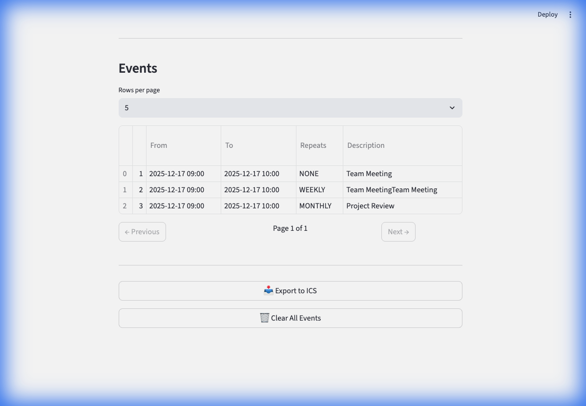
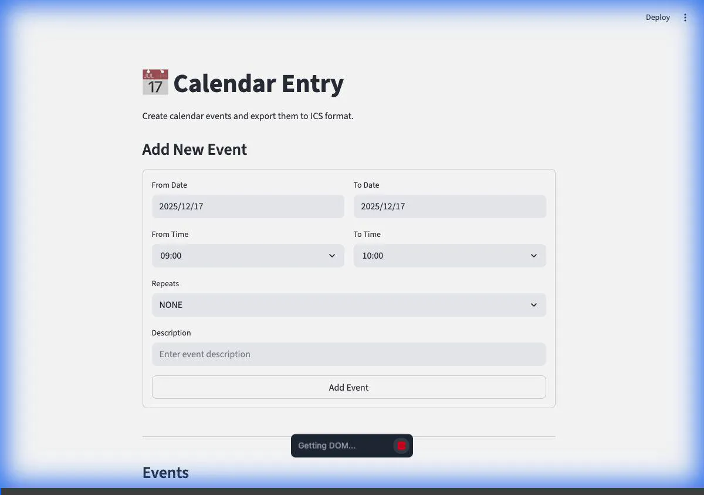

# 📅 Memory Calendar

A lightweight Streamlit app for creating calendar events and exporting them to ICS format for Google Calendar.



## Features

- **DateTime Form**: Add events with start/end datetime, recurrence pattern, and description
- **Paginated Table**: View all entries with pagination controls
- **ICS Export**: Download `.ics` file compatible with Google Calendar and other calendar apps
- **Recurrence Support**: Daily, Weekly, Monthly, and Annually repeating events

## Prerequisites

- Python 3.10+
- [uv](https://docs.astral.sh/uv/) package manager

## Installation

```bash
# Clone the repository
git clone <repo-url>
cd swateek-calendar-entry

# Install uv (if not already installed)
curl -LsSf https://astral.sh/uv/install.sh | sh
source $HOME/.local/bin/env

# Install dependencies
uv sync
```

## Usage

### Run the App

```bash
uv run streamlit run app.py
```

The app will open at http://localhost:8501

### Adding Events

1. Fill in the **From** date and time
2. Fill in the **To** date and time
3. Select a **Repeats** pattern (NONE, DAILY, WEEKLY, MONTHLY, ANNUALLY)
4. Enter a **Description**
5. Click **Add Event**

### Exporting to ICS

1. Add one or more events
2. Click **📥 Export to ICS**
3. Import the downloaded `events.ics` file into Google Calendar:
   - Open Google Calendar → Settings → Import & Export → Import

## Demo



## Project Structure

```
swateek-calendar-entry/
├── app.py              # Main Streamlit application
├── pyproject.toml      # Project dependencies (uv)
├── uv.lock             # Lock file
├── docs/
│   ├── screenshot.png  # App screenshot
│   └── demo.webp       # Demo recording
└── README.md
```

## License

MIT
